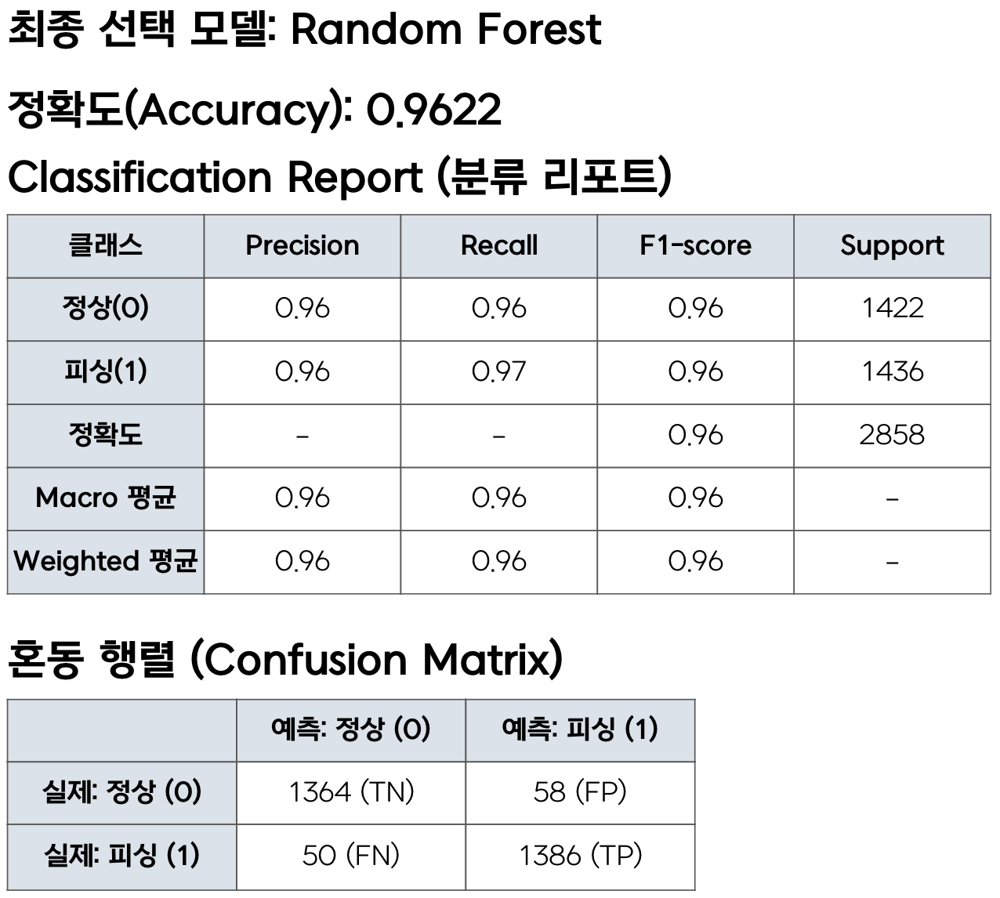
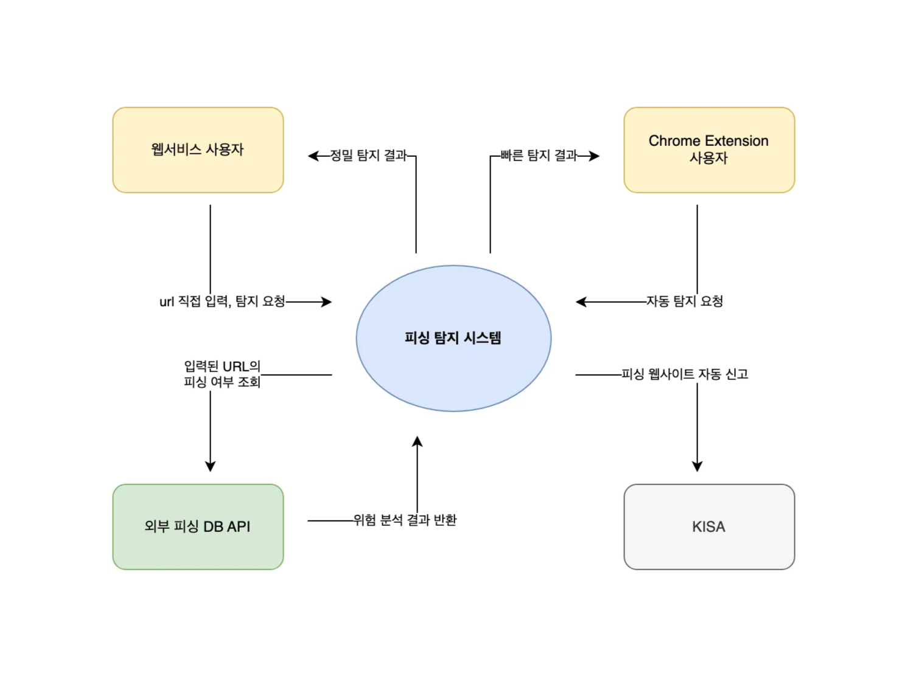

  <h1 style="margin: 0; font-size: 28px;">피싱 웹 사이트 탐지 시스템 |   </h1>

 

## 🌊 소개

<strong>wave to www</strong>는 <strong>누구나 쉽게 사용할 수 있도록 설계된 사용자 중심의 피싱 탐지 서비스</strong>입니다.
단순히 <strong>위험 여부만을 알려주는 기존 방식</strong>에서 한 걸음 더 나아가,
<strong>AI 분석</strong>과 <strong>룰 기반 코드 분석</strong>을 결합하여 <strong>왜 위험한지에 대한 근거</strong>까지 함께 제공합니다.

<strong>HTML, JavaScript, URL 패턴 등 피싱 사이트의 공통적인 특징</strong>을 사전에 분석하고 이를 <strong>모듈화</strong>하여
<strong>탐지의 정밀도</strong>와 <strong>설명력</strong>을 높였습니다. <strong>웹 기반 서비스</strong>와 <strong>크롬 확장 프로그램</strong> 두 가지 형태로 제공되며,
사용자는 <strong>직접 URL을 입력</strong>하거나 <strong>웹서핑 중 마우스오버만으로 실시간 탐지</strong>를 받을 수 있습니다.

<strong>누구나 이해할 수 있는 시각적 결과</strong>와 함께,
<strong>전문가에게는 분석 도구로</strong>, <strong>기관에는 대응 체계로 활용</strong> 가능한
<strong>범용성과 실용성</strong>을 갖춘 서비스입니다.

  

--- 

## 🍀 목차

- [🌊 소개](#-소개)
- [✅ 주요 기능](#-주요-기능)
- [🦾 AI](#-ai)
- [🛠 기술 스택](#-기술-스택)
- [🛠 System Context Diagram](#-system-context-diagram)
- [🛠 Component Diagram](#-component-diagram)
- [🛠 Deployment Diagram](#-deployment-diagram)
- [📁 프로젝트 구조](#-프로젝트-구조)
- [🚀 실행 방법](#-실행-방법)
  - [🔗 서비스 링크](#-서비스-링크)
  - [🌊 사용 흐름](#-사용-흐름)
- [👩‍💻 프로젝트 참여자](#-프로젝트-참여자)

---

## ✅ 주요 기능

### **1. 정밀 분석 웹 서비스**

 이 서비스는 사용자가 의심되는 URL을 직접 입력하면 백엔드에서 URL을 받아 분석을 수행하고, 그 결과를 웹 인터페이스를 통해 시각적으로 제공하는 구조이다. 분석은 커널을 통해서 다중 모듈 기반으로 이루어지며, 다음과 같은 핵심 기능을 포함한다.

- **HTML 구조 분석** : 입력된 URL의 HTML을 파싱하여, 가짜 로그인 폼, 숨겨진 입력 창, 외부 리소스 연결 여부 등을 탐지한다.
- **JavaScript 정적/동적 분석** : DOM 조작 또는 사용자 입력 탈취 목적의 JavaScript를 감지한다.
- **URL 패턴 및 도메인 분석** : 도메인 유사도, IP 기반 URL, URL 인코딩 여부 등을 바탕으로 위험 점수를 부여한다.
- **AI 기반 판단 모듈**: 페이지의 구조적 특징을 기반으로 학습된 모델로 위험 여부를 예측한다.
- **근거 제시** : 탐지 결과에 대해 모듈별 위험도와 근거 메시지를 출력하여 어떤 부분에서 어떤 이유 때문에 탐지가 되었는지 근거를 제시한다.
- **자동 제보 기능** : 위험 사이트로 판단된 경우, KISA(한국인터넷진흥원)에 자동 신고 메일을 전송한다. SMTP 기반 발신 시스템을 구성했다.

 이러한 기능들을 종합하여 사용자에게 단순히 ‘위험’ 여부 뿐만 아니라 왜 위험한지를 정확히 설명하고, 다음 행동까지 연결할 수 있도록 동작하는 서비스를 구현했다.

 ### **2. 실시간 탐지 Chrome Extension**

 웹 서비스가 사용자의 의도적 입력을 기반으로 한다면, 크롬 익스텐션 서비스는 사용자의 일상적인 웹 서핑 중 자연스럽게 피싱을 방지할 수 있는 실시간 서비스이다. 핵심 특징은 다음과 같다.

- **마우스 호버링 기반 URL 탐지**: 사용자가 웹페이지에서 링크 위에 마우스를 올리는 순간, 해당 URL을 서버로 전송하여 실시간 분석을 수행한다.
- **즉시 결과 표시**: 분석 결과는 해당 링크 옆에 팝업 형태로 표시되며, 위험 시 경고 아이콘과 함께 요약 메시지를 띄운다.
- **요청 최적화 처리**: 초기에는 마우스 이동 시 지나가는 모든 링크가 요청되어 서버 과부하 문제가 있었지만, 디바운싱 기법과 캐싱, 스로틀링 처리를 통해 이를 해결했다.
- **UI 친화성**: 페이지의 흐름을 방해하지 않는 비동기 처리 구조로 구성되었고, 경고 메시지 외에 별도의 사용자 동작 없이 서비스를 경험할 수 있다.

 이 익스텐션은 특히 비전공자, 일반 사용자들에게 매우 직관적인 형태의 보안 서비스 형태로 개발하였다.

---

## 🦾 AI

사용 데이터셋: https://www.kaggle.com/datasets/shashwatwork/web-page-phishing-detection-dataset?resource=download

---

## 🛠 기술 스택

  
  

---

## 🖥️ 시스템 구조 및 설계

### 📊 System Context Diagram

  

### 🧩 Component Diagram

  

### 🔧 Deployment Diagram

  

---

## 📁 프로젝트 구조

<pre>
PROJECT/
├── .github/                                  
├── scripts/                                  # 배포 및 실행 스크립트 모음
├── source/                                   
│   └── chrome_extension/                     # Chrome Extension
│       └── gui/                              # Front-End
│           ├── dist/                         # 빌드 결과물
│           │   └── assets/                   # 배포용 이미지 등 리소스
│           └── src/                          # 확장 프로그램 원본 코드
│               └── assets/                   # 확장용 이미지 등 리소스
├── kernel/                                   # Kernel
│   ├── engines/                              # 탐지 엔진 베이스 및 모듈들
│   ├── kernel_db/                            # 탐지에 사용되는 각종 DB
│   │   ├── data_black_list/                  # 블랙리스트 (브랜드, 도메인, 링크)
│   │   ├── data_etc/                         # 기타 TLD, 국가 코드 등
│   │   └── data_white_list/                  # 화이트리스트 도메인
│   ├── plugins/                              # 탐지 모듈 플러그인 모음
│   │   ├── ai_modules/                       # AI 관련 모듈
│   │   │   ├── ai_model/                     # 학습된 모델(pkl 파일 등)
│   │   │   └── ai_source/                    # 특징 추출 등 AI 추론 코드
│   │   ├── html_modules/                     # HTML 기반 탐지 모듈
│   │   ├── js_modules/                       # JS 기반 탐지 모듈
│   │   └── url_modules/                      # URL 기반 탐지 모듈
├── server/                                   # Server - Back-End : FAST API
│   ├── app/                                  # 서버 애플리케이션 모듈
│   │   ├── schemas/                          # 요청/응답 스키마 정의
│   │   └── utils/                            # 공통 유틸리티 함수들
│   ├── server_config/                        # 서버 설정 파일
│   └── sessions/                             # 사용자 세션 관리 모듈
├── tests/                                    # 모듈별 테스트 코드
│   └── module_test/
│       ├── module_test_data/                 # 테스트용 피싱 데이터
│       └── module_test_results/              # 테스트 결과 스크립트
├── web/                                      # 사용자 웹 인터페이스 (React)
│   └── gui/
│       └── React/
│           ├── public/                       # 정적 파일 (index.html 등)
│           └── src/                          # React 앱 소스
│               ├── assets/                   # 이미지 및 폰트 리소스
│               │   ├── fonts/                # Poppins 등 폰트 파일
│               │   └── img/                  # 로고, 아이콘 등 이미지
│               ├── components/               # 공통 UI 컴포넌트
│               ├── pages/                    # 페이지 단위 컴포넌트
│               └── styles/                   # CSS 스타일 파일
</pre>

---

## 🚀 실행 방법

### 🔗 서비스 링크

  
  &nbsp;
  

### 🌊 사용 흐름

---

## 👩‍💻 프로젝트 참여자

<table style="border: none;">
  <tr>
    <td align="center"><strong>여지훈</strong></td>
    <td align="center"><strong>강지민</strong></td>
    <td align="center"><strong>서하진</strong></td>
    <td align="center"><strong>이기석</strong></td>
  </tr>
  <tr>
    <td align="center"></td>
    <td align="center"></td>
    <td align="center"></td>
    <td align="center"></td>
  </tr>
  <tr>
    <td align="center">🌈 <strong>PM</strong> 🛠️ <strong>백엔드</strong></td>
    <td align="center">🌳 <strong>AI</strong> 🎨 <strong>디자인</strong></td>
    <td align="center">⚙️ <strong>커널</strong></td>
    <td align="center">📱 <strong>프론트엔드</strong></td>
  </tr>
</table>

